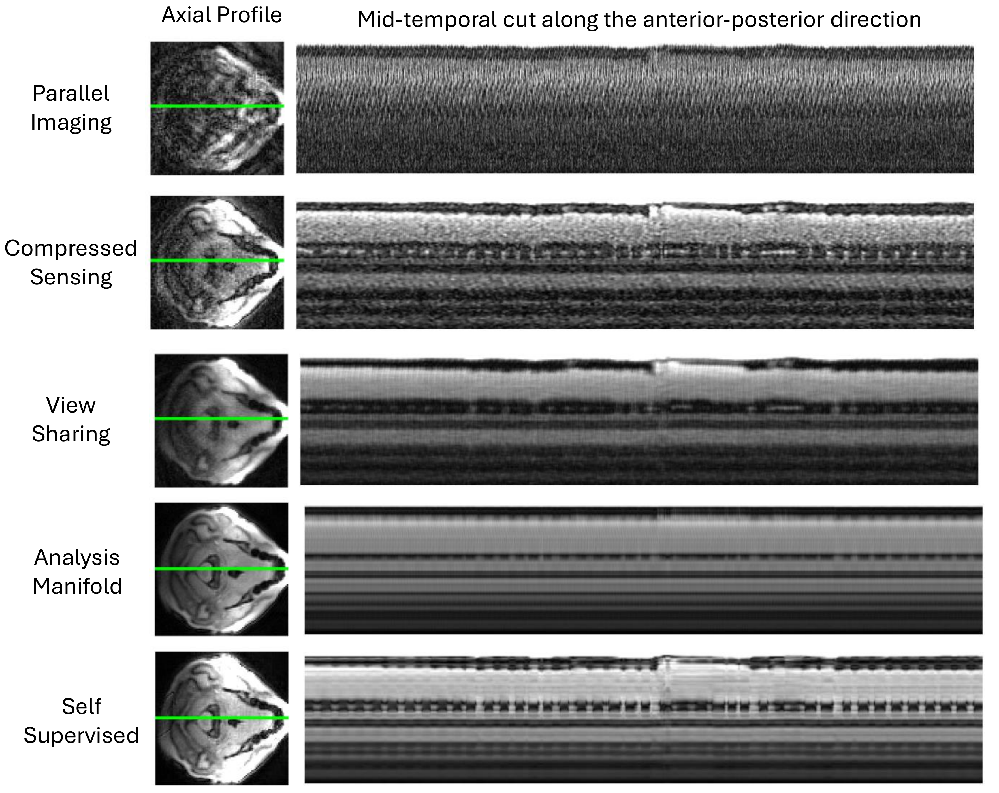
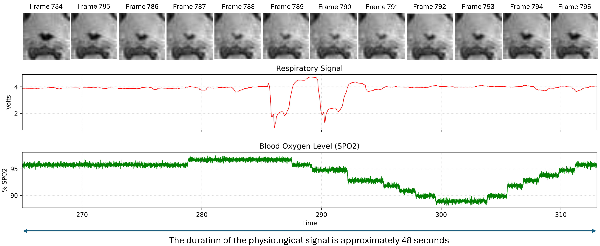
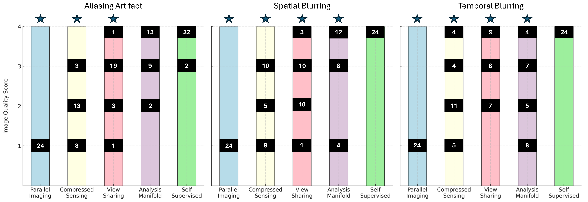
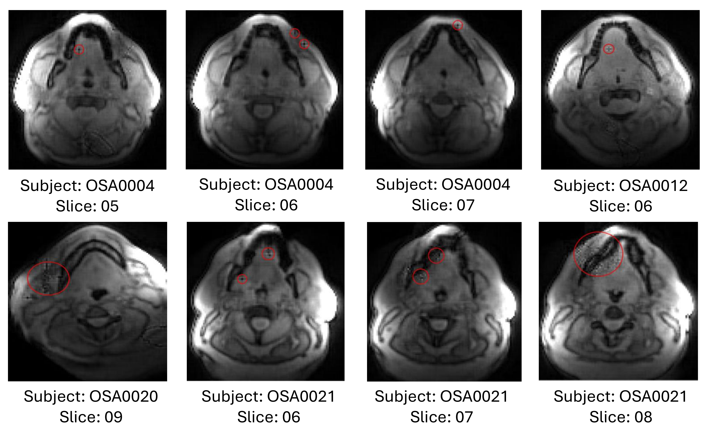

# Prospective Validation of Self-Supervised Spiral Variational Manifold Learning for Upper-Airway Collapse Imaging

**Magnetic Resonance in Medicine** | University of Iowa

[](https://www.python.org/)
[](https://pytorch.org/)
[](LICENSE)
[](https://www.nih.gov/)

> **Md Shahin Ali<sup>1</sup>, Wahidul Alam<sup>1</sup>, Mathews Jacob<sup>2</sup>, Douglas Van Daele<sup>3</sup>, Junjie Liu<sup>4</sup>, Sajan Goud Lingala<sup>1,5</sup>**
>
> <sup>1</sup>Roy J. Carver Department of Biomedical Engineering, University of Iowa  
> <sup>2</sup>Department of Electrical and Computer Engineering, University of Virginia  
> <sup>3</sup>Department of Otolaryngology, University of Iowa  
> <sup>4</sup>Department of Neurology, University of Iowa  
> <sup>5</sup>Department of Radiology, University of Iowa  
>
> Correspondence: [sajangoud-lingala@uiowa.edu](mailto:sajangoud-lingala@uiowa.edu)

---

## Abstract

Dynamic upper-airway MRI during natural sleep can localize obstructive sleep apnea (OSA) collapse patterns, but practical multi-slice imaging is limited by long scan times and temporal blurring under acceleration. We develop and prospectively validate a **physics-guided, self-supervised spiral variational manifold reconstruction** for temporally precise, multi-slice upper-airway MRI — without external training data.

Across 12 datasets (8 OSA patients during natural sleep + 4 healthy volunteers during Müller maneuver), the proposed method achieved **mean expert scores of 3.92 / 4.00 / 4.00** for aliasing, spatial blurring, and temporal blurring, significantly outperforming analysis manifold, compressed sensing, parallel imaging, and view sharing (*p* < 0.001). Temporal resolution: **183 ms/frame** across 11 concurrent axial slices.

---

## Method Overview

<p align="center">
  
</p>

*The self-supervised pipeline splits acquired k-space into training and validation sets. A CNN generator learns from undersampled data, using latent vectors to encode temporal dynamics. Physics-guided early stopping prevents overfitting by monitoring the held-out validation loss — no fully sampled reference data required.*

The reconstruction solves:

$$C(\theta, l_{s,t}) = \sum_{s,t} \| \mathsf{E}_{\Gamma,s,t}(G_\theta(l_{s,t})) - \Omega(\Gamma) \|_2^2 + \sigma^2 R^{\text{scale}}_{l_{s,t}} + \lambda_1 R_{G_\theta} + \lambda_2 R^{\text{temporal Tikhonov}}_{l_{s,t}}$$

where $G_\theta$ is a CNN generator mapping latent vectors $l_{s,t}$ to multi-slice image volumes, $\Gamma$ is the training mask, and the terms enforce data consistency, variational latent prior, generator regularization, and temporal smoothness.

---

## Results

### Adaptive vs. Fixed Learning Rate

<p align="center">
  
  
</p>

*Left: Fixed learning rate leads to overfitting and temporal artifacts at late epochs. Right: Validation-loss–guided adaptive learning rate stabilizes training and preserves temporal fidelity throughout optimization.*

### Effect of Validation-Set Splitting Distribution

<p align="center">
  
</p>

*Comparison of right-skewed, left-skewed, normal, and uniform splitting strategies. Right-skewed allocation of high-frequency samples to the training set achieves the best SER (22.78 dB) and sharpest air–tissue boundaries.*

### Prospective Reconstruction Comparison (OSA Patient, Natural Sleep)

<p align="center">
  
</p>

*Mid-temporal spatiotemporal profiles from prospectively undersampled spiral data. The proposed self-supervised method preserves sharp air–tissue boundaries and smooth temporal evolution, outperforming parallel imaging, compressed sensing, view sharing, and analysis manifold.*

### Correlation with Physiological Signals

<p align="center">
  
</p>

*Dynamic airway reconstruction from OSA0001 alongside respiratory effort (red) and SpO₂ (green). The model detects genuine collapse events — reflected in a 2–5% drop in oxygen saturation — that other methods fail to capture.*

### Temporal Airway Dynamics (12 Consecutive Frames)

<p align="center">
  
</p>

*12-frame comparison for OSA0007, Slice 6. The self-supervised model consistently resolves two distinct airway structures with smooth temporal evolution (frames 4–11), while competing methods show noise, blurring, or loss of the secondary airway structure.*

### Expert Image Quality Scores

<p align="center">
  
</p>

| Method | Aliasing ↑ | Spatial Blurring ↑ | Temporal Blurring ↑ |
|---|---|---|---|
| **Self-Supervised (Ours)** | **3.92** | **4.00** | **4.00** |
| Analysis Manifold | 3.42 | 3.17 | 2.25 |
| View Sharing | 2.88 | 2.62 | 3.08 |
| Compressed Sensing | 1.75 | 2.04 | 2.29 |
| Parallel Imaging | 1.00 | 1.00 | 1.00 |

*Kruskal–Wallis: aliasing H=98.57, spatial H=82.18, temporal H=76.69 (all p<0.001). Scoring rubric: 1=unacceptable, 4=excellent.*

### Reconstruction Artifacts

<p align="center">
  
</p>

*Artifacts (red circles) were observed in only 8 of 136 reconstructed slices (5.88%), appearing as spurious signal intensities or localized distortions. These are rare but motivate future work on anatomy-aware regularization.*

---

## Repository Structure

```
.
├── main_reconstruction.py       # Main reconstruction script (one-cell, slices 1–11)
├── dataOpNewKbnufft.py          # Data loading, k-space operators, coil sensitivity estimation
├── generator_320.py             # CNN generator (320×320 complex-valued output)
├── latentVariable.py            # Latent variable module with KL and smoothness regularization
├── optimize_gen_sub.py          # Training loop with self-supervised early stopping
├── Figures/                     # Paper figures (FIG1–FIG10)
├── Data/                        # (Not included) Raw .mat k-space data
├── requirements.txt             # Python dependencies
└── README.md
```

### Module Descriptions

**`dataOpNewKbnufft.py`** — Handles all data I/O and MRI forward/adjoint operators. Reads `.mat` or pickle k-space files, applies FOIVR-based virtual coil compression (PCA), estimates coil sensitivity maps via ESPIRiT / JSENSE / Inati / Walsh, precomputes Toeplitz kernels for fast NUFFT operations, and splits k-t data into disjoint training and validation sets using configurable distributions (right-skewed, left-skewed, normal, uniform).

**`generator_320.py`** — Defines the `generatorNew` CNN module, a 10-layer convolutional architecture with nearest-neighbor upsampling that maps 30-dimensional latent vectors to complex-valued 320×320 image frames. Outputs real and imaginary channels separately, then recombines. Includes L1 weight regularization via `weightl1norm()`.

**`latentVariable.py`** — Defines the `latentVariableNew` class managing the temporal latent trajectory $l_{s,t} \in \mathbb{R}^{N_\text{frames} \times 30 \times 1 \times 1 \times N_\text{slices}}$. Supports multiple initialization strategies (`ones`, `random`, `zeros`, `interpolate`). Implements KL divergence loss and temporal Tikhonov smoothness regularization.

**`optimize_gen_sub.py`** — Main training loop. Jointly optimizes generator parameters and latent vectors using Adam with a `ReduceLROnPlateau` scheduler driven by the held-out validation loss. Includes per-epoch validation, divergence detection, and checkpoint saving at minimum validation loss.

**`main_reconstruction.py`** — Top-level script orchestrating the full pipeline per slice: data loading → 10-epoch initial training → 150-epoch final training → complex frame generation → saving 320×320 and 120×120 `.mat` outputs → GIF creation from magnitude images.

---

## Installation

### Requirements

- Python ≥ 3.8
- CUDA-capable GPU (≥ 16 GB VRAM recommended for 11 slices)

### Setup

```bash
git clone https://github.com/<your-username>/<repo-name>.git
cd <repo-name>
pip install -r requirements.txt
```

### Key Dependencies

| Package | Purpose |
|---|---|
| `torch` | Neural network and GPU computation |
| `torchkbnufft` | Non-Cartesian k-space NUFFT and Toeplitz operators |
| `sigpy` | MRI coil sensitivity estimation (JSense) |
| `mat73` | Reading MATLAB v7.3 `.mat` files |
| `scipy` | Signal processing and generalized eigenvalue decomposition |
| `imageio` | GIF generation from magnitude frames |
| `scikit-learn` | PCA-based coil compression |
| `ismrmrdtools` | Inati / Walsh coil sensitivity methods |

Full list: see [`requirements.txt`](requirements.txt).

---

## Usage

### 1. Prepare Your Data

The reconstruction expects k-space data in a MATLAB `.mat` file (v7.3) with the following variables:

```
kdata  — [nReadouts, nCoils, nArms, nSlices]   complex64
k      — [nReadouts, nArms]                     complex64  (trajectory)
dcf    — [nReadouts, nArms]                     float32    (density compensation)
```

### 2. Configure Parameters

Edit the `params_template` dictionary in `main_reconstruction.py`:

```python
params_template = {
    'filename':        "/path/to/your/data.mat",  # ← your data path
    'nintlPerFrame':   3,        # spiral arms per temporal frame
    'nFramesDesired':  1700,     # number of temporal frames to reconstruct
    'nBatch':          6,        # mini-batch size
    'gen_base_size':   60,       # generator base channel width
    'siz_l':           30,       # latent vector dimensionality
    'virtual_coils':   8,        # number of virtual coils after compression
    'splitRatio':      0.10,     # fraction of readouts reserved for validation
    'splitDist':       'rightSkewed',   # validation split distribution
    'coilEst':         'espirit',       # coil sensitivity method
    'ssTrainMode':     True,     # enable self-supervised training
    ...
}
```

### 3. Run Reconstruction

```bash
# Reconstruct slices 1–11 (adjust range as needed)
python main_reconstruction.py
```

Per-slice output (saved automatically):

```
<data_dir>_RECONS_60d/
├── results_espirit_<N>thSlice_.../
│   ├── Recon_<N>thSlice_...frms.mat          # 120×120 complex (Recon120)
│   ├── Recon_<N>thSlice_...frms.gif          # magnitude GIF
│   └── Uncropped/
│       └── Recon320_<N>thSlice_...frms.mat   # 320×320 complex (Recon320)
```

### 4. Output Format

Both `.mat` files store **complex-valued reconstructions**:

```python
# Load in Python
from scipy.io import loadmat
data = loadmat('Recon_1thSlice_...frms.mat')
recon = data['Recon120']   # shape: (nFrames, 120, 120, 2)
                           # last dim: [real, imag]

# Load in MATLAB
load('Recon_1thSlice_...frms.mat')
% Variable: Recon120  → [nFrames × 120 × 120 × 2]
% Variable: Recon320  → [nFrames × 320 × 320 × 2]
```

---

## Pre-trained Models / Checkpoints

Reconstructions are fully **self-supervised and patient-specific** — no pre-trained models are required or shared. Each run trains from scratch on a single subject's k-space data.

Checkpoint files (`.pth`) are saved automatically during training at:
- `weights_onlyGenerator_.../init_weights_slice<N>_epoch10.pth` — after initial 10-epoch warmup
- `weights_GENplusLAT.../bestModelValPoint_splitRatio<r>_epoch<e>_valLoss_<v>.pth` — best validation checkpoint during final training

---

## Data Availability

The OSA patient data used in this study cannot be publicly released due to IRB and patient privacy restrictions. To request access for research collaboration, please contact the corresponding author.

---

## Citation

If you use this code or method in your research, please cite:

```bibtex
@article{ali2025prospective,
  title   = {Prospective validation of self-supervised spiral variational manifold
             learning for upper-airway collapse imaging},
  author  = {Ali, Md Shahin and Alam, Wahidul and Jacob, Mathews and
             Van Daele, Douglas and Liu, Junjie and Lingala, Sajan Goud},
  journal = {Magnetic Resonance in Medicine},
  year    = {2025},
  note    = {Under review}
}
```

---

## Acknowledgements

This work was supported by the **National Institutes of Health** under grant **NIH NHLBI R01 HL173483**. MRI data were acquired on an instrument funded by NIH-S10 instrumentation grant **1S10OD025025-01**.

---

## License

This project is licensed under the MIT License — see [LICENSE](LICENSE) for details.
